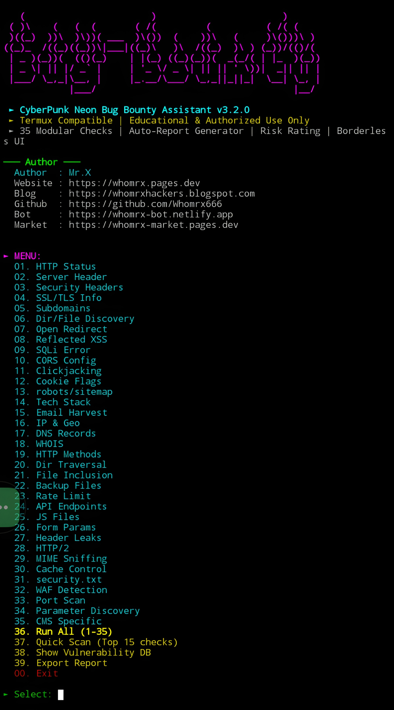

# Bug-bounty


<p align="center">
  <strong>Advanced Bug Bounty & Security Scanner for Termux (No Root)</strong><br>
  <em>"35 real world security checks – from subdomains to WAF detection – in a cyberpunk neon shell." — Mr.X</em>
</p>

## Introduction
**Bug-bounty** is a powerfull all in one reconnaissance and vulnerability assessment tool built for mobile and terminal environments.With **35 integrated security modules**, it performs deep analysis of web targets, including subdomain enumeration, SSL/TLS inspection, header analysis, XSS/SQLi detection, CORS misconfigurations, directory brute forcing, and much more – all without requiring root privileges.

The tool features a **Borderless neon style ui**, runs smoothly on **Termux (Android)** , Linux, and any Python supported platform, and produces detailed reports in JSON, HTML, CSV, or plain text.

---

## Installation
```bash
$ pkg update -y && pkg upgrade -y
$ pkg install git python -y
$ git clone https://github.com/Whomrx666/Bug-bounty.git
$ cd Bug-bounty
$ python3 install.py
```

## Run manually
```
$ python3 bug-bounty.py
```

Features

- **35 real World Security Modules** – From HTTP status and SSL expiry to subdomain discovery, XSS, SQLi, CORS, clickjacking, port scanning, and WAF detection.
- **Termux Optimized** – Fully functional on Android with no root required.
- **Cyberpunk Neon UI** – Boot animation, two column menu, color coded output, and risk classification.
- **Multiple Report Formats** – Export session results as JSON, HTML, CSV, or plain text.
- **Comprehensive Vulnerability Database** – Each module includes risk description and mitigation advice.
- **Quick Scan & Full Scan** – Run all 35 checks at once or a focused quick scan (top 15).
- **Parallel Port Scanning** – Fast scanning of top 20 ports using multithreading.
- **DNS & Subdomain Enumeration** – Uses crt.sh and common subdomain lists.
- **Smart Parameter Discovery** – Extracts parameters from forms, URLs, and JavaScript.
- **CacheControl & MIME Sniffing Checks** – Helps prevent caching of sensitive data and MIMEbased attacks.

## Instructions

1. Install the tool using the commands above.
2. Run python3 bug-bounty.py to launch the neon interface.
3. Enter the target URL (e.g., https://example.com or example.com).
4. Select a module by number (1–35), or use special options:
   · 36 – Run all 35 modules
   · 37 – Quick scan (15 essential checks)
   · 38 – View vulnerability database (risks & mitigations)
   · 39 – Export report in your preferred format (JSON, HTML, CSV, TXT)
   · 00 – Exit
5. Follow onscreen prompts – most modules work automatically; some may ask for additional input (e.g., port ranges for scanning, but currently fixed to top 20 ports).
6. Review results displayed with colorcoded statuses (Safe / Verify / Unknown) and detailed mitigation tips.
7. Export your report after scanning to keep a record of findings.

## Observation
This tool is intended for **educational and ethical hacking purposes only**. Unauthorized scanning of systems you do not own or have explicit permission to test is illegal. The author assumes no responsibility for misuse or damage caused by this tool.

### Original Author
<a href="https://github.com/Whomrx666"></a>

### <<< If you copy , Then Give me The Credits >>>

## CONNECT WITH ME :

[](https://whomrxhackers.blogspot.com/)
[](https://twitter.com/whomrx666)
[](https://wa.me/6285926601133?text=Halo%2C%20Mr.X)
[](https://www.facebook.com/whomrx.666)
[](https://t.me/Whomr_X)
[](mailto:whomrx666@gmail.com)
[](https://www.tiktok.com/@whomr.x)

**If you want to donate, click on the button**
<a href="https://saweria.co/whomrx"></a>

---

<p align="left">
  
</p>